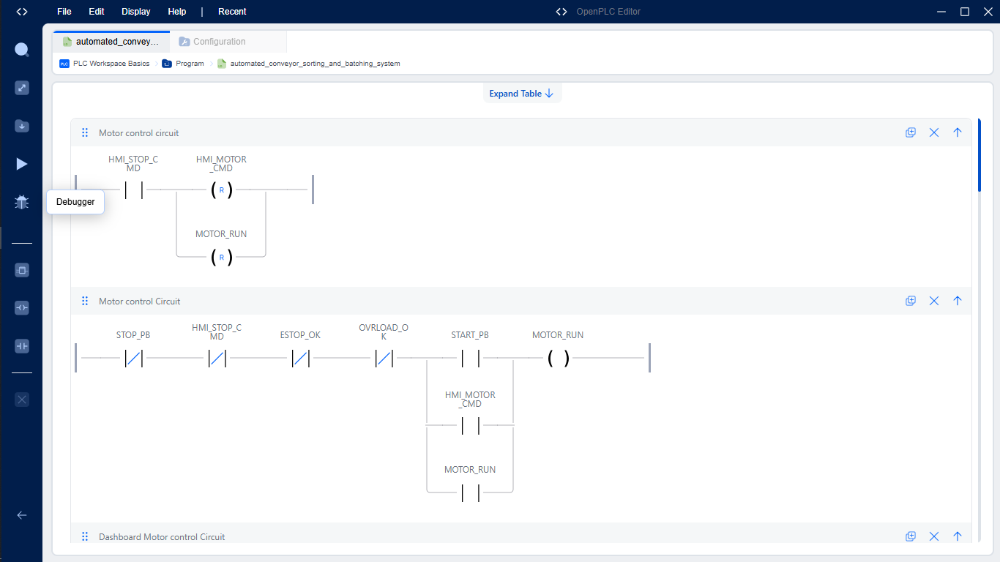
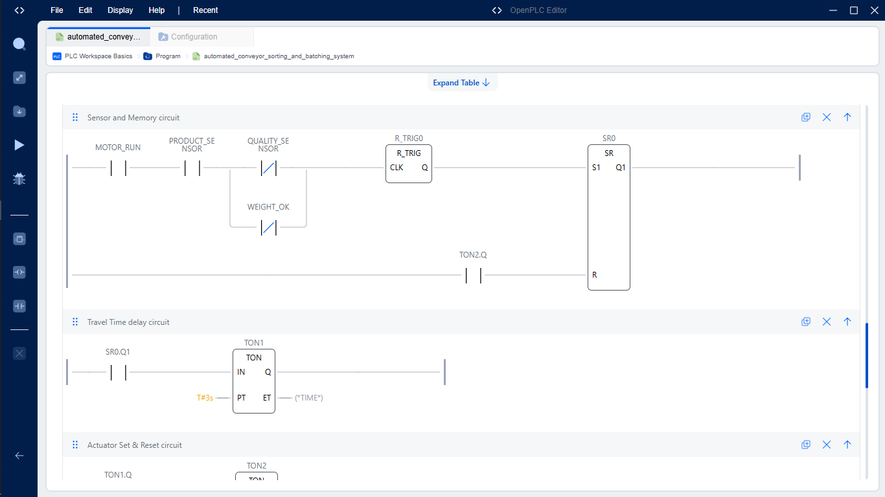
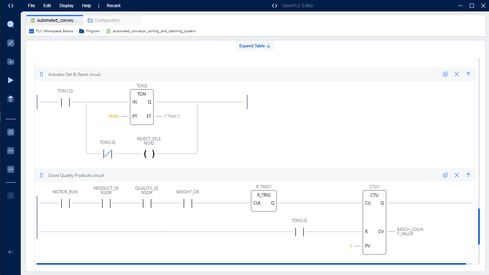
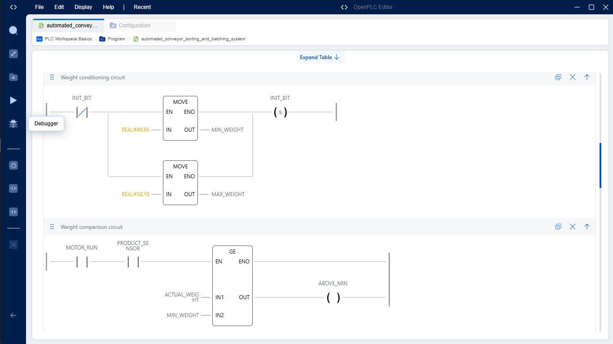
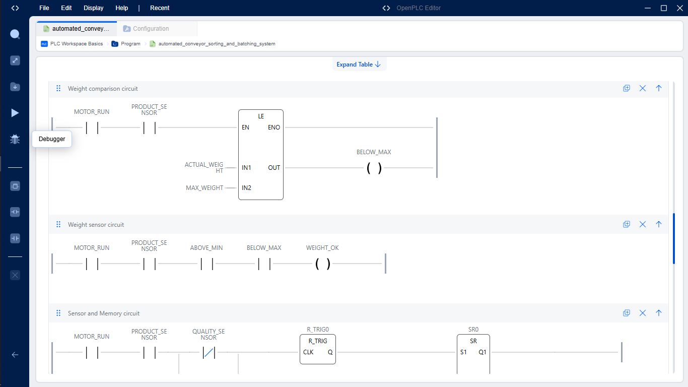
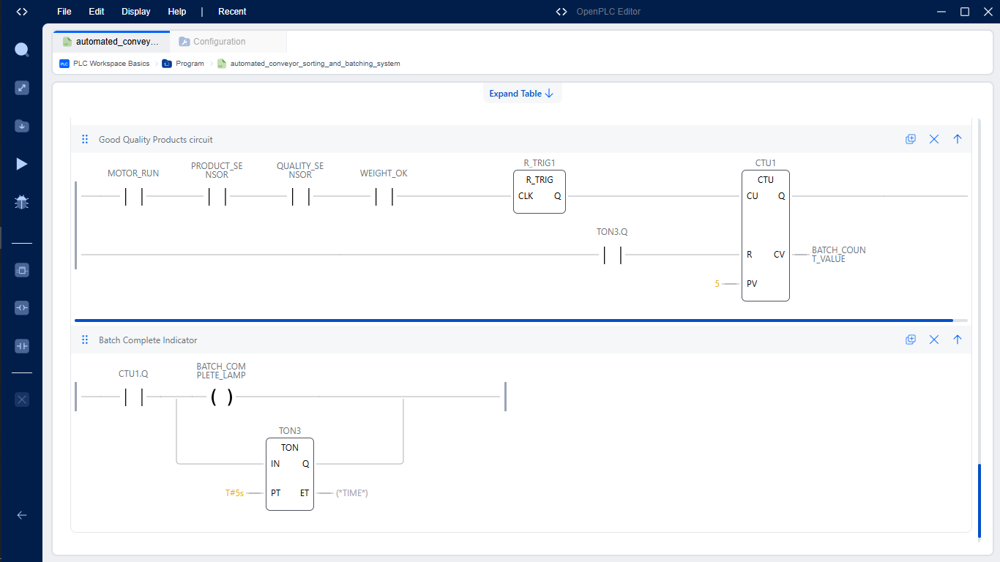
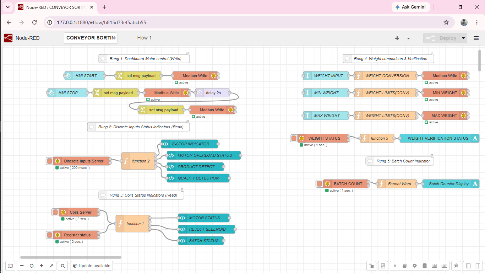
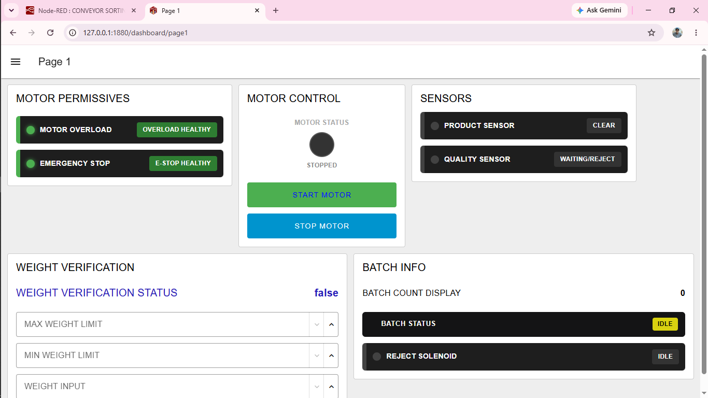
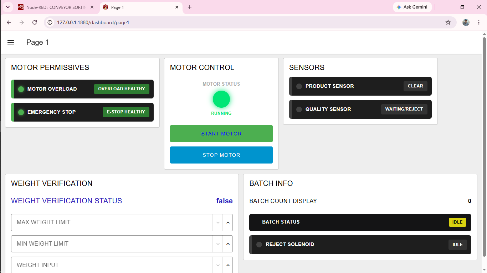

# HMI Integrated Conveyor System

An industrial automation project developed using **OpenPLC Ladder Logic** and integrated with a **Node-RED HMI** through **Modbus TCP**.

The system simulates an automated conveyor process in which products are transported, detected, evaluated against weight and quality criteria, rejected when non-compliant, and counted into production batches.

The project demonstrates practical implementation of PLC control logic, safety interlocking, sensor processing, timers, counters, product rejection, batch management, industrial communication, and HMI-based monitoring and control.

---

## Project Overview

The system is designed around an automated conveyor sorting and batching process.

The **OpenPLC controller** is responsible for the core automation and process-control functions, including:

- Conveyor motor control
- Physical start and stop control
- HMI-based motor control
- Emergency-stop interlocking
- Overload protection
- Product detection
- Product weight processing
- Weight validation
- Quality inspection
- Non-standard product rejection
- Accepted-product counting
- Batch management
- Running-status indication

A **Node-RED HMI** provides the operator interface for controlling and monitoring the system.

Communication between Node-RED and OpenPLC is implemented using **Modbus TCP over port 5020**.

The project therefore combines a PLC control layer with a supervisory HMI and industrial communication interface.

---

## System Architecture

The system consists of three main layers:

### 1. Operator Interface

The Node-RED HMI provides the operator with controls and visual feedback for the conveyor system.

The HMI is used to:

- Start the conveyor
- Stop the conveyor
- Monitor motor status
- Monitor safety conditions
- Observe process information
- Monitor batch information

### 2. PLC Control Layer

OpenPLC executes the Ladder Logic responsible for the actual automation process.

The PLC handles:

- Motor control
- Safety interlocks
- Sensor processing
- Product detection
- Weight conditioning
- Product classification
- Rejection control
- Product counting
- Batch management

### 3. Communication Layer

Node-RED communicates with OpenPLC using **Modbus TCP**.

The configured communication port for this project is:

**Port: 5020**

This allows HMI commands to be transferred to the PLC while selected PLC states and process values are read by Node-RED for display on the HMI.

---

# PLC Control Logic

The control system was developed in **OpenPLC using Ladder Logic**.

The program is divided into functional sections, with each section responsible for a specific part of the automated conveyor process.

---

## 1. Motor Control Circuit

The motor control circuit manages the operation of the conveyor motor.

The motor can be initiated through the available physical and HMI control commands while the required safety and operating conditions remain satisfied.

The motor control logic also incorporates the required stop and safety conditions to prevent continued operation when the system should be stopped.

### Motor Control Circuit

---

## 2. Motor Memory and Control Logic

A memory/latching section is used to maintain the required motor control state after the start command has been activated.

This allows the momentary start command to initiate motor operation while the control logic maintains the running state until a relevant stop condition or safety interlock occurs.

### Motor Memory Circuit

---

## 3. Sub-Standard Product Rejection

The rejection section handles products that do not meet the required processing criteria.

The PLC evaluates the product conditions and activates the rejection sequence when a product is identified as non-compliant.

The rejection logic controls the reject actuator to remove the sub-standard product from the accepted production flow.

### Sub-Standard Product Rejection

---

## 4. Weight Conditioning and Validation

The system processes the raw weight input and converts it into a usable weight value for product evaluation.

A scale factor is applied to the raw input to calculate the actual product weight.

The calculated weight is then compared against configured minimum and maximum limits.

The project uses the following configured weight limits:

- **Minimum weight:** 49.95 kg
- **Maximum weight:** 50.10 kg

Products within the configured acceptable range satisfy the weight condition and can proceed to the next stage of the classification process.

### Weight Conditioning Circuit 1

### Weight Conditioning Circuit 2

---

## 5. Standard Product Batching

Products that satisfy the required conditions are processed as standard products and contribute to the production batch.

An edge-triggered counting mechanism is used so that a detected product contributes a controlled increment to the batch count.

The batching section provides the basis for monitoring production quantity and determining when the configured batch quantity has been achieved.

### Standard Products Batching

---

# PLC Programming Techniques

The OpenPLC program demonstrates several practical industrial automation programming techniques, including:

- Ladder Logic programming
- Motor start/stop control
- Memory and latching logic
- Safety interlocking
- Emergency-stop handling
- Overload protection
- Timer-based control
- Rising-edge detection
- Counter implementation
- Sensor-based sequencing
- Analog value processing
- Weight scaling
- Limit comparison
- Product classification
- Reject actuator control
- Batch counting
- HMI command processing

These techniques demonstrate how individual PLC instructions can be combined to implement a complete automated process.

---

# Node-RED Integration

The OpenPLC control system is integrated with **Node-RED** to provide a Human Machine Interface (HMI) for operator control and real-time process monitoring.

Communication between Node-RED and OpenPLC is implemented using **Modbus TCP over port 5020**.

The integration was successfully tested, with Node-RED exchanging control commands and process information with the OpenPLC Ladder Logic through the configured Modbus TCP connection.

This provides a communication interface between the PLC control layer and the operator interface.

---

## Complete Node-RED Flow

The Node-RED flow contains the communication and processing required to connect the HMI with the OpenPLC control system.

---

# Human Machine Interface (HMI)

A **Node-RED dashboard** was developed to provide the operator with a graphical interface for controlling and monitoring the conveyor system.

The HMI communicates with OpenPLC through the configured **Modbus TCP connection on port 5020**.

The dashboard provides an operator-facing interface for issuing control commands and observing the resulting state of the conveyor system.

---

## HMI Motor Stopped State

The stopped-state dashboard provides a visual indication that the conveyor motor is not running.

---

## HMI Motor Running State

When the motor is started and the required control conditions are satisfied, the HMI reflects the running state of the conveyor.

---

# Modbus TCP Communication

Communication between the OpenPLC controller and Node-RED HMI is implemented using **Modbus TCP**.

The configured communication port for the project is:

**5020**

Modbus TCP provides the communication interface through which Node-RED can send commands to the PLC and read selected process information and status values from the control system.

---

## Communication Roles

| System | Role |
|---|---|
| OpenPLC | PLC control and process logic |
| Node-RED | HMI and supervisory interface |
| Modbus TCP | Industrial communication protocol |
| Port 5020 | Communication port |

---

## PLC Variables Used for HMI Integration

The OpenPLC project defines dedicated variables for interaction between the PLC and HMI.

| Variable | Address | Type | Function |
|---|---|---|---|
| `HMI_MOTOR_CMD` | `%MX0.0` | BOOL | HMI motor start command |
| `HMI_STOP_CMD` | `%MX0.1` | BOOL | HMI motor stop command |
| `BATCH_COUNT_VALUE` | `%MW0` | INT | Batch count value |
| `MOTOR_RUN` | `%QX0.0` | BOOL | Motor running status |
| `LAMP_RUN` | `%QX0.1` | BOOL | Running indicator |
| `PRODUCT_SENSOR` | `%IX0.4` | BOOL | Product detection input |

---

## HMI Control Communication

The operator issues commands through the Node-RED HMI.

The command is processed by Node-RED and transferred to the corresponding PLC memory location using Modbus TCP.

The PLC then processes the command through the Ladder Logic and controls the relevant part of the conveyor system.

This architecture keeps the operator interface separate from the underlying PLC control logic.

---

## PLC Status Monitoring

Selected PLC variables can be read by Node-RED and presented to the operator through the HMI.

This provides visibility of important process states such as:

- Motor running status
- Running indicator
- Product detection
- Batch count
- Safety-related conditions

The result is a supervisory interface that allows the operator to observe the current state of the automated process.

---

# Control Sequence

The overall conveyor process follows the following sequence:

1. The system checks the required safety conditions.
2. The conveyor can be started using the physical start control or HMI command.
3. The motor control logic maintains conveyor operation while the required conditions remain satisfied.
4. A product is detected on the conveyor.
5. The product weight is processed and converted into a usable value.
6. The calculated weight is evaluated against the configured minimum and maximum limits.
7. Product quality is evaluated using the relevant quality condition.
8. Products that do not satisfy the required conditions are directed through the rejection logic.
9. Accepted products are counted using the product-counting logic.
10. The batch count is updated as accepted products are processed.
11. The batch completion condition is used to manage the production batch.
12. The process continues until the conveyor is stopped or a safety condition interrupts operation.

---

# Project Structure

The repository is organized to separate the PLC program, HMI implementation, documentation, and visual project evidence.

The project structure is:

    HMI-Integrated-Conveyor-System
    │
    ├── assets
    │
    ├── documentation
    │
    ├── Node-RED
    │   └── flows.json
    │
    ├── OpenPLC
    │   └── ACBSS.xml
    │
    ├── screenshots
    │   ├── OpenPLC
    │   │   ├── 01-motor-control-circuit.PNG
    │   │   ├── 02-motor-memory-circuit.PNG
    │   │   ├── 03-substandard-product-rejection.PNG
    │   │   ├── 04-weight-conditioning-1.PNG
    │   │   ├── 05-weight-conditioning-2.PNG
    │   │   └── 06-standard-products-batching.PNG
    │   │
    │   ├── Node-RED
    │   │   └── 01-complete-nodered-flow.PNG
    │   │
    │   └── HMI
    │       ├── 01-hmi-motor-stopped-state.PNG
    │       └── 02-hmi-motor-running-state.PNG
    │
    └── README.md

---

# Repository Contents

| Folder / File | Purpose |
|---|---|
| `OpenPLC/` | Contains the OpenPLC PLC project |
| `Node-RED/` | Contains the Node-RED flow used for HMI and Modbus TCP communication |
| `screenshots/OpenPLC/` | Screenshots documenting the main PLC Ladder Logic sections |
| `screenshots/Node-RED/` | Screenshot documenting the complete Node-RED flow |
| `screenshots/HMI/` | Screenshots showing the HMI operating states |
| `documentation/` | Supporting project documentation |
| `assets/` | Additional project resources and visual assets |
| `README.md` | Main project documentation |

---

# Technologies Used

The project combines several technologies used in industrial automation and control engineering.

### PLC and Control

- OpenPLC
- Ladder Logic
- Timers
- Counters
- Edge detection
- Latching and memory logic
- Digital inputs and outputs
- Weight processing and comparison

### HMI and Supervisory Control

- Node-RED
- Node-RED Dashboard
- HMI control elements
- Real-time process monitoring

### Industrial Communication

- Modbus TCP
- TCP/IP networking
- PLC-to-HMI communication
- Port 5020

---

# Skills Demonstrated

This project demonstrates practical development and integration skills in:

- Industrial automation
- PLC programming
- Ladder Logic
- Motor control
- Safety interlocking
- Sensor integration
- Timer and counter implementation
- Product sorting
- Weight validation
- Batch management
- HMI development
- Node-RED
- Modbus TCP
- PLC-HMI integration
- Troubleshooting and debugging
- Industrial control-system architecture

---

# Project Objective

The objective of this project was to develop a practical industrial automation system that demonstrates the integration of **PLC control, process logic, industrial communication, and HMI supervision**.

Rather than treating the PLC and HMI as separate systems, the project demonstrates how they can be integrated into a functional automation architecture.

The project provides practical experience in developing control logic, processing sensor information, managing actuators, implementing safety conditions, communicating through Modbus TCP, and presenting process information through an HMI.

---

# Future Improvements

Potential future improvements include:

- Integration with physical PLC hardware
- Integration of physical conveyor and sensors
- Addition of an industrial weighing system
- Expanded production statistics
- Alarm and fault-history logging
- Improved batch-management functionality
- Historical process-data logging
- User access levels for HMI operation
- Additional industrial communication interfaces
- Integration with higher-level SCADA or manufacturing systems

---

# Conclusion

The HMI Integrated Conveyor System demonstrates a complete small-scale industrial automation workflow using **OpenPLC, Ladder Logic, Node-RED, HMI technology, and Modbus TCP**.

The project combines PLC-based process control with an operator interface, allowing the system to perform conveyor control, product detection, product evaluation, rejection, counting, and batch management while providing operator visibility through the HMI.

The successful communication between **Node-RED and OpenPLC through Modbus TCP port 5020** demonstrates practical PLC-HMI integration and provides a foundation for further development toward physical industrial automation systems.

---

